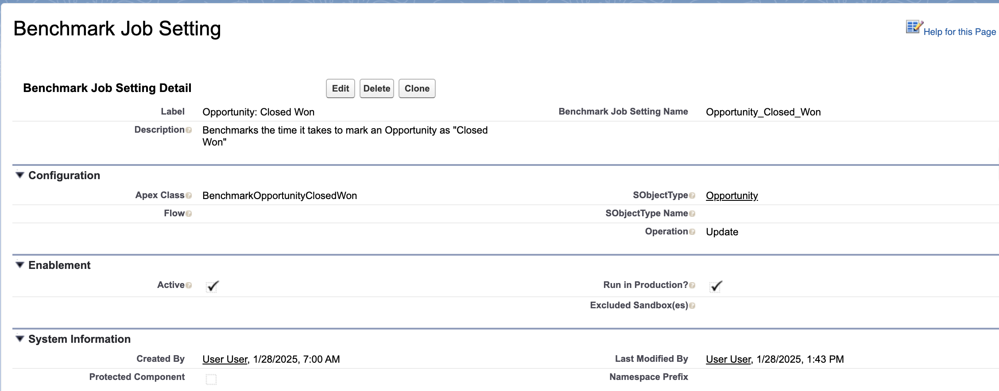
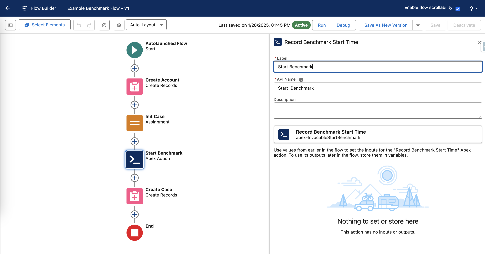
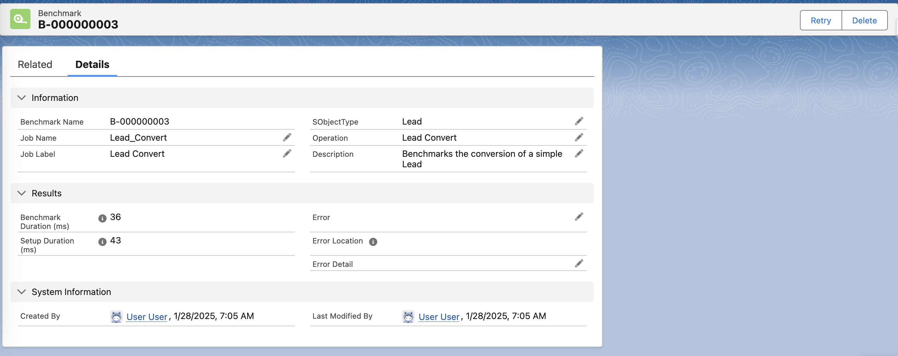
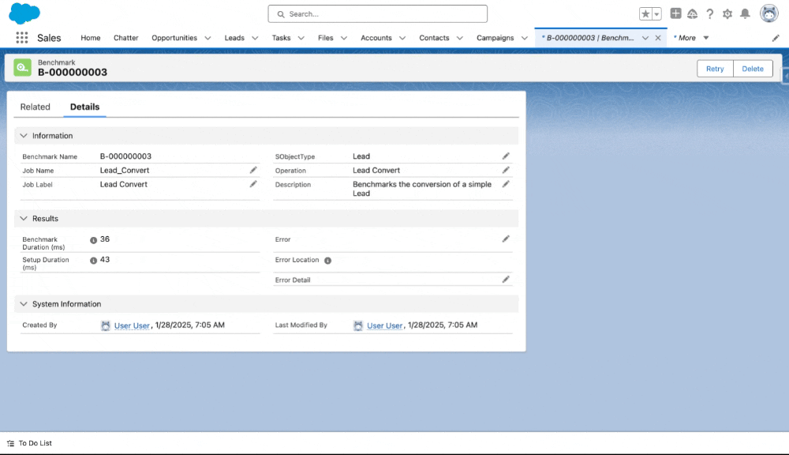
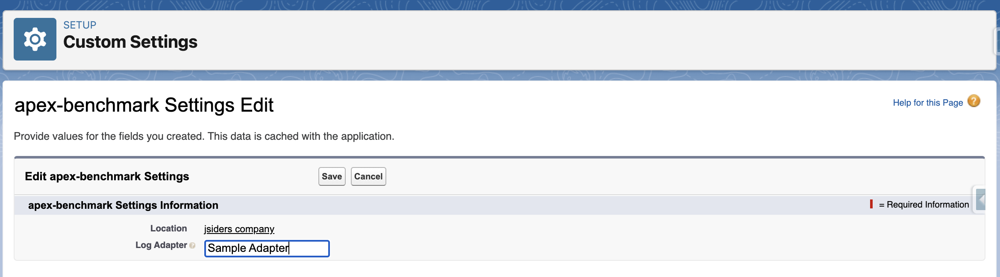

# `apex-benchmarking`

Many Salesforce orgs struggle with performance. Whether you’re an admin, developer, or end user, you’ve probably spent too much time staring at a spinning wheel or waiting for save operations to complete. And if you’re “lucky,” you’ve likely seen this error a time or two:

```sh
System.LimitException: Apex CPU time limit exceeded
```

As Salesforce Developers, making sure our automations and processes run as efficiently as possible is a top priority. Yet, the Salesforce platform doesn't offer anything to measure performance in a way that’s automated, consistent, and repeatable.

`apex-benchmarking` aims to bridge this gap. The framework provides Salesforce Developers an automated way to measure the performance of critical automations and processes over time.

---

## Getting Started

`apex-benchmarking` is available as an unlocked package. You can find all package version ids catalogued in the repo's [Releases](https://github.com/jasonsiders/apex-benchmarking/releases/).

### Installation

Run the following command, replacing `<<package_version_id>>` with your desired package ID (which begins with `04t`):

```sh
sf package install --package <<package_version_id>> --wait 10
```

### Provisioning

The results of Benchmark jobs are stored in a custom object, called `Benchmark__c`. To be able to view these records, users must have access to the object.

You can provision access to this object via one of the included permission sets:

- `BenchmarkAccess`: Gives **read-only** access to _Benchmark_ records.
- `BenchmarkAdministrator`: Gives **full** access to _Benchmark_ records.

Run the following command to assign yourself the appropriate permissions:

```sh
sf org assign permset --name BenchmarkAdministrator
```

---

## Usage

Once the package is installed, follow these steps to get started:

1. Define "Benchmark Jobs" to specify the actions you want to measure.
2. Schedule the Benchmark Jobs to run at regular intervals.
3. Monitor and analyze the resulting `Benchmark__c` records to track performance.

### Creating Benchmark Jobs

#### Step 1: Create a `BenchmarkJobSetting__mdt` Record

Every Benchmark Job requires a corresponding `BenchmarkJobSetting__mdt` record. This custom metadata type defines the configuration for the job:



Each record will be linked to an `Apex Class` or a `Flow`, either of which will be dynamically instantiated and run during a run of the Benchmark Job for the current settings record.

You can also include optional details about the job, such as the `SObjectType` and the type of `Operation` being performed or benchmarked. These details will be recorded in the resulting `Benchmark__c` records and can be helpful for reporting.

You can also use this record to configure where and when Benchmark jobs should run:

- **Active:** If unchecked, the specified Benchmark job will not run. If checked, the job will run, as long as it’s eligible in the current environment (see below).
- **Excluded Sandbox(es):** A comma-separated list of sandbox names (e.g., `full`, `partial`, `uat`). The specified Benchmark job will not run in these sandboxes.
- **Run In Production?:** If checked, the Benchmark job will run in Production (and Developer Edition) orgs. By default, this is `false`.

> _:rotating_light: **IMPORTANT**: Each Benchmark Job is rolled back at the end of the transaction. However, some actions (such as "deliver immediately" Platform Events, API calls, etc.) cannot be rolled back. For this reason, use extreme caution if you choose to set `Run in Production` to true._

#### Step 2: Defining Benchmark Job Logic

You can use Apex _or Flows_ to define the logic to be executed during your Benchmark Jobs. Expand each of the sections below for more information:

<details>
  <summary>Using Apex:</summary>
  
If the `BenchmarkJobSetting__mdt` includes an `ApexClass__c` value, then each run of the given Benchmark Job will use that value to dynamically create a `Benchmarkable` instance. The framework then uses this class to setup and execute the logic to be benchmarked, and then stores details about the run in the `Benchmark__c` custom object.

The `Benchmarkable` interface requires two methods:

- `void setup()`: Handles any pre-processing needed for the test case.
- `void benchmark()`: Executes the specific action to be measured by the Benchmark Job.

For accurate results, the `benchmark()` method should focus solely on the action being measured. Avoid including unnecessary code—use the `setup()` method for any pre-processing instead.

> **Note:** You do not need to worry about recording when the `setup()` and `benchmark()` methods start/finish; this happens automatically when using Apex.

Here is an example implementation that measures the time it takes to create a `Contact` record.

```java
public without sharing class BenchmarkContactCreate implements Benchmarkable {
  private Contact contact;

  public void setup() {
    // Insert an Account
    Account acc = new Account(Name = 'Test Account');
    Database.insert(acc, System.AccessLevel.SYSTEM_MODE);
    // Create a Contact, to be inserted later...
    this.contact = new Contact(AccountId = acc?.Id, FirstName = 'John', LastName = 'Doe');
  }

  public void benchmark() {
    // Insert the aforementioned Contact
    Database.insert(this.contact, System.AccessLevel.SYSTEM_MODE);
  }
}
```

</details>

<details>
  <summary>Using Flow:</summary>

If the `BenchmarkJobSetting__mdt` includes an `Flow__c` value, then each run of the given Benchmark Job will use that value to dynamically run that flow.

Like with Apex, your flow should contain the action you want to measure, along with any necessary preceding setup actions.

Unlike with Apex, the framework cannot automatically capture all start/finish times. Instead, developers must use an Invocable Action call (`InvocableStartBenchmark`) to deliniate when Setup tasks have completed, and when Benchmarking begins.

As such, each Flow should follow this general pattern:

1. Perform any setup tasks (ie., inserting parent records)
2. Run the `InvocableStartBenchmark`/**"Run Benchmark Start Time"** action
3. Perform the processing task you want to benchmark

For example, see the included [sample flow](/example-app/flows/Example_Benchmark_Flow.flow-meta.xml):



</details>

### Schedule Recurring Benchmark Jobs

To schedule your benchmark jobs to run at regular intervals, use the included `BenchmarkSchedulable` class.

This class will execute any Benchmark Jobs configured in the `BenchmarkJobSetting__mdt` table, as long as they are active and eligible to run in the current environment.

For example, this anonymous Apex script schedules benchmark jobs to run at the top of each hour:

```java
String jobName = 'Benchmark: Hourly';
String hourlyCron = '0 0 * * * ?';
System.Schedulable job = new BenchmarkSchedulable();
Id jobId = System.schedule(jobName, hourlyCron, job);
System.debug('Scheduled: ' + jobId);
```

### Monitoring

The results of each benchmark job are recorded in the `Benchmark__c` custom object:



The **Retry** button on the Benchmark record allows for users to manually re-run the current Benchmark Job. When the job runs, it will create a net-new Benchmark record:



You can also run reports on this object to monitor the performance of specific benchmarks over time.

## Optional Plugins

### Logging

By default, the application will post internal logs to standard Salesforce debug logs. If desired, you can write an Apex adapter which will cause these internal logs to be published via the logging application of your choice. Read more below:

<details>
  <summary>Implement a Logger Plugin:</summary>

To get started, first create an Apex class that fulfills these requirements:

1. Implement the `BenchmarkLogs.Adapter` interface (shown below).
2. Ensure your class has a publicly accessible, 0-argument constructor

Here's a sample adapter that hooks into the [`apex-logger`](https://github.com/jasonsiders/apex-logger) framework:

```java
public class SampleAdapter implements BenchmarkLogs.Adapter {
    // This is the Logger object from apex-logger
    private Logger logger = new Logger();

    public void log(System.LoggingLevel level, Object message) {
        this.logger?.log(level, message);
    }

    public void save() {
        this.logger?.publish();
    }
}
```

Once defined, list the fully qualified API name of your class, including namespace (if any) in the `apex-benchamrk Settings`'s _Log Adapter_ field:


</details>
